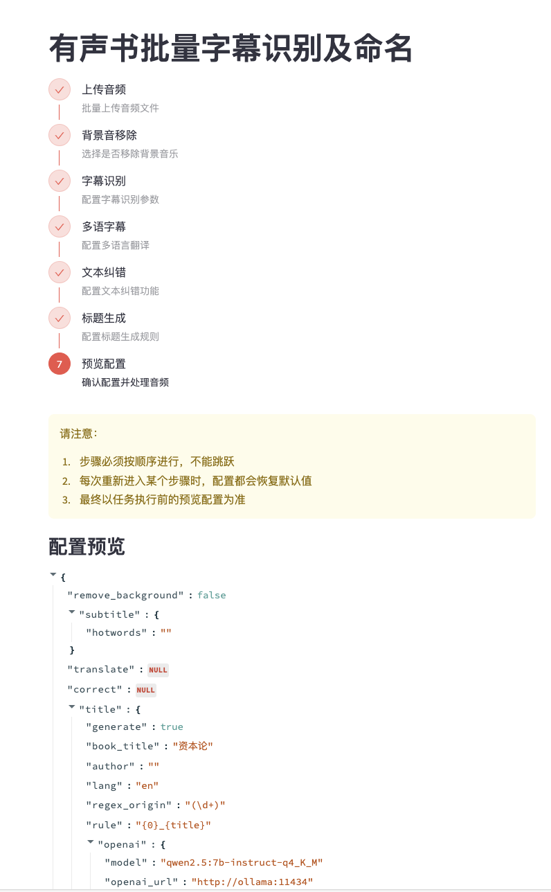
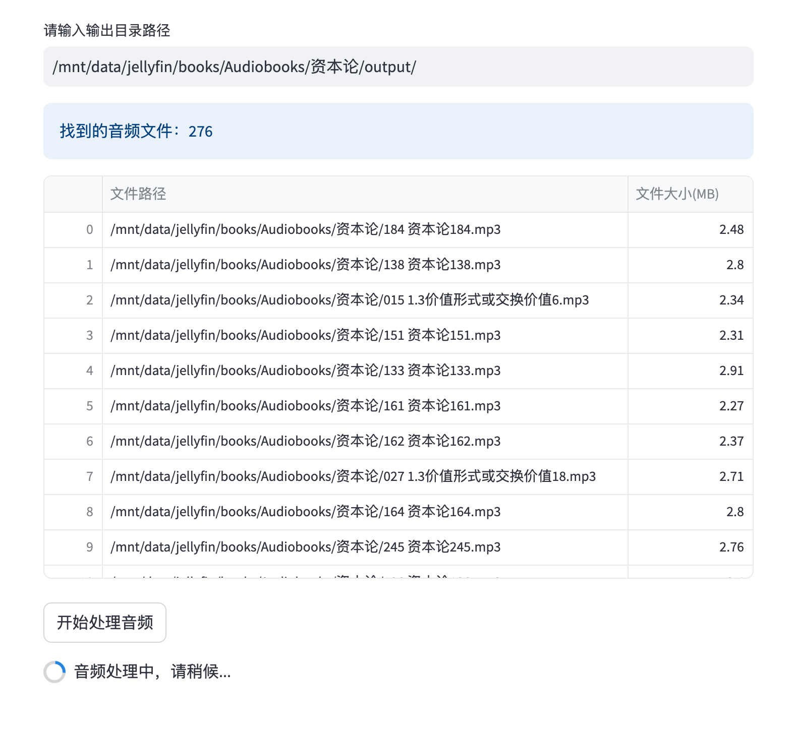
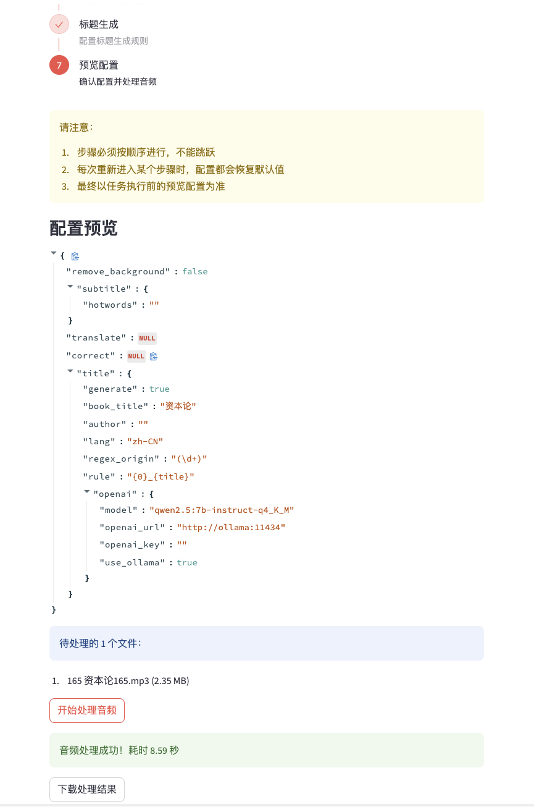
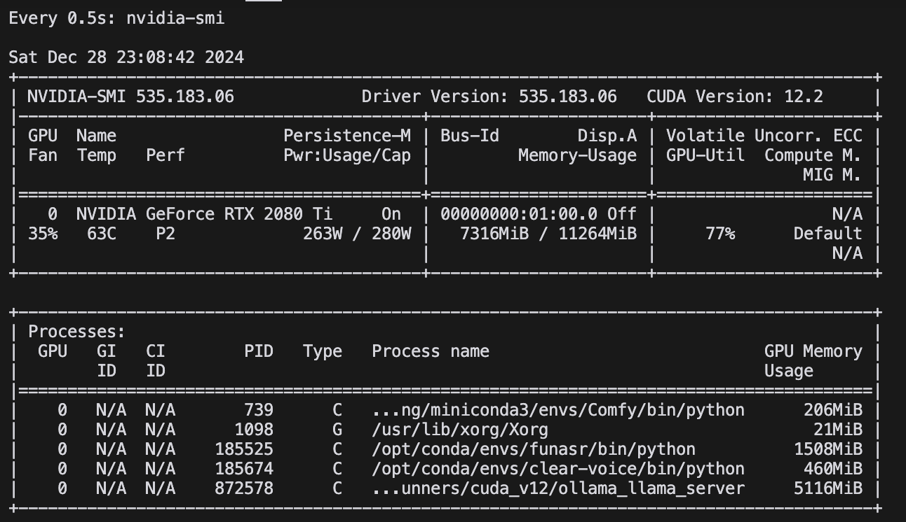

# LiberSonora

> todo:: 放一个 logo，纯色底，音频和书籍相关

LiberSonora，寓意“自由的声音”，是一个 AI 赋能的、强大的、开源的有声书工具集，全程离线，支持 GPU 加速、批量处理及自定义大模型


## 🌟 项目亮点

📚 **开源自由**
- 采用 MIT 许可证，真正的开源免费
- 音频处理与大模型推理全程本地离线运行
- 自主可控，数据安全有保障

🚀 **便捷部署**
- 项目容器化，开发与部署便利
- 支持 API，轻松集成到个人工作流

🧩 **模块化设计**
- 各功能模块独立
- 可单独启动特定服务（如音频增强、字幕识别等）

🔧 **灵活定制**
- 支持自定义大模型，针对特定任务提升效果
- 配置灵活多样，满足不同需求

💡 **创新功能**
- 持续更新，引入最新AI技术
- 提供独特的音频处理与文本生成能力

# 🚀 LiberSonora 发展规划

项目的愿景是打造一个全方位的有声书生态系统，分三个阶段逐步实现：

## 🎯 第一期：智能字幕提取、标题生成与多语言支持（核心功能已完成）
🎯 解决的核心问题：
- 📁 智能重命名：摆脱"第001集_xxxx.mp3"、"Chapter_001.mp3"等无意义命名，轻松找到感兴趣的内容
- 📄 自动字幕生成：为无字幕音频添加精准字幕，实现文字内容快速定位
- 🗣️ 多语言学习辅助：借助大模型翻译，提供多语言字幕，助力语言学习

✨ 功能：
- 🎙️ 有声书音频字幕提取
- 🏷️ AI 智能命名工具
- 🌐 AI 驱动的多语言翻译
- 🇬🇧 英语有声书全面支持
- 🏠 项目官方网站搭建


## 🎵 第二期：全平台有声书播放器（功能和技术栈规划中，开始时间待定）

🎯 解决的核心问题：
- 🎧 商业播放器本地功能薄弱
- 🗂️ 文件管理不便，界面不够美观
- 🚫 频繁弹窗广告干扰用户体验

✨ 功能：
- 💻🍎📱 跨平台支持
- ☁️ 采用 WebDAV 等开放协议，实现本地同步，避免复杂的服务端开发
- 🖥️ 服务端 NAS 友好，支持 docker、飞牛、群晖等
- 📚 有声书专属逻辑：
   - 🚫 纯净无广告体验
   - 🖼️ 自动抓取网络封面
   - 📊 基于有声书维度的进度管理、倍速管理、独立音量管理
- 🔗 支持 WebDAV、SMB 等协议，便捷接入 ALIST 或 NAS 资源
- 📴 离线模式与下载功能，节省存储空间，适应各种使用场景
- 🔊 超大音量模式：
   - 适应嘈杂环境（如通勤、散步）
   - 用手机释放更大的音量，无需耳机或便携音箱
   - 解决部分有声书音量过小的问题
   - 牺牲部分音质换取更大音量输出


## 🔮 第三期：AI 辅助创作工具（暂无规划）

✨ 功能：
- 🗣️ 整合声音克隆技术
- 📑 智能内容拆分与排版
- 🔗 与第二期播放器深度联动

> ⏳ 受个人时间和精力限制，项目进展可能较为缓慢。计划先实现一二期的核心功能，再逐步完善细节。

> 💖 如果您喜欢这个项目，欢迎赞助支持我们的开发！
> 


## 功能列表

- [x] 有声音频批量处理
- [x] 移除背景音
- [x] 本地大模型进行字幕矫正
- [x] 本地大模型生成双语字幕
- [x] 本地大模型生成标题生成
- [x] 自动标点移除
- [x] 支持灵活的批量重命名
- [x] API 支持
- [ ] 提供云服务
- [ ] 国际化接轨，实现英文界面和英文 README
- [ ] CPU 可运行（低优先级，可能不做，由于 clear-voice 和 funasr 项目依赖原因，这个项目现在只能用带 nvidia GPU 的环境运行）

### 字幕转换和重命名结果示例下载

> 有声书资源均来自互联网，仅供效果参考和学习，若有侵犯著作权利请联系我删除

> 若想转换你正在听的有声书，但又不想搭建环境，可以到 [📚有声书转换体验区](https://github.com/LiberSonora/LiberSonora/discussions/1) 留言

| 书名 | 下载链接 | 提取码 | 备注 |
|------|----------|--------|------|
| 《资本论.马克思》 | https://pan.quark.cn/s/7d2e048b0747 | uhjP | 经典政治经济学著作，中文 |
| 《苦难辉煌.金一南》 | https://pan.quark.cn/s/b37fd2be9d50 | Mhud | 现代历史题材作品，中文 |
| 《Alice's Adventures in Wonderland.Lewis Carroll》 | https://pan.quark.cn/s/2699b5b63abc | FNx8 | 爱丽丝梦游仙境，源语言英语+标题英语+字幕自动翻译中文 |
| 《Romeo and Juliet.William Shakespeare》 | https://pan.quark.cn/s/27cb7de6f7ce | pjJ9 | 罗密欧与朱丽叶，源语言英语+标题英语+字幕自动翻译中文 |

## 字幕识别和大模型翻译支持

### 字幕识别支持
- ✅ 中文（zh-CN）
- ✅ 英语（en）

### 多语言字幕翻译支持

| 语言 | 支持状态 | 备注 |
|------|----------|------|
| 中文（zh-CN） | ✅ 支持 | 源语言，翻译目标语言 |
| 英语（en） | ✅ 支持 | 源语言，翻译目标语言 |
| 日语（ja） | ✅ 支持 | 翻译目标语言 |
| 法语（fr） | ✅ 支持 | 翻译目标语言 |
| 德语（de） | ✅ 支持 | 翻译目标语言 |

> 注意：多语言字幕翻译功能依赖于本地大模型，翻译质量可能因模型版本和上下文理解能力而有所不同


## 音乐软件字幕兼容性
| 软件名称 | 本地音乐 | 本地字幕支持 | 多语言字幕兼容 | 备注 |
|----------|----------|--------------|----------------|------|
| 网易云音乐 | 支持 | 支持 | 兼容 | |
| 小米音乐 | 支持 | 支持 | 兼容 | 单语言字幕正常，但多语言字幕进度条会偏快 |
| QQ音乐 | 支持 | 不支持 | 不兼容 | 只能云搜索歌词 |
| 酷狗音乐 | 支持 | 不支持 | 不兼容 | 只能云搜索歌词 |
| 酷我音乐 | 支持 | 不支持 | 不兼容 | 只能云歌词 |
| 汽水音乐 | 不支持 | 不支持 | 不兼容 | |
| 咪咕音乐 | 支持 | 不支持 | 不兼容 | |
| 喜马拉雅 | 不支持 | 不支持 | 不支持 | 不能导入 |
| MacOS Apple Music | 支持 | 不支持 | 不支持 | 不能导入 lrc/src 音频 |

> 相比之下，目前的商业播放器在本地有声书播放场景上，还是网易云在这方面的兼容性好点，但网易云的本地音乐没有进度记录或已播放的功能，切回到他的在线音乐之后很难找回进度，这也是想做全平台有声书播放器的原因之一


## 🖥️ 功能界面展示

### 📚 批量处理有声书页面
<div align="center">
  
  <p><i>强大的批量处理功能，轻松处理大量有声书</i></p>
</div>

### 🖥️ 服务器本地音频处理页面
<div align="center">
  
  <p><i>高效处理服务器本地音频文件，省去文件传输步骤，提升处理效率</i></p>
</div>

### 🔍 手动检查输出结果页面
<div align="center">
  
  <p><i>便捷的手动检查功能，可手动命名也可让 AI 重新生成</i></p>
</div>


### 🧪 独立服务测试页面
<div align="center">
  
  <p><i>灵活的单一服务测试，快速验证各项功能</i></p>
</div>


## 快速开始

> 注：项目依赖安装和模型下载已配置国内镜像，但 docker 的代理得自行设置，安装速度取决于网速和服务器性能，安装依赖大概15分钟，推理模型下载取决于网速，一般十分钟内

1. 克隆项目仓库：
   ```
   git clone https://github.com/LiberSonora/LiberSonora
   ```

2. 进入项目目录：
   ```
   cd LiberSonora
   ```

3. 启动 Docker 容器：
   ```
   docker-compose -f docker-compose.gpu.yml up -d
   ```

4. 查看容器运行日志：
   ```
   docker-compose -f docker-compose.gpu.yml logs -f
   ```

5. 访问用户界面：
   打开浏览器，访问 `xxx.xxx.xxx.xxx:8651`（将 xxx.xxx.xxx.xxx 替换为您的服务器 IP 地址）

6. API 端点：
   API 服务可通过 `xxx.xxx.xxx.xxx:8652` 访问（将 xxx.xxx.xxx.xxx 替换为您的服务器 IP 地址）

## API 接口文档

### 批量处理音频

> 注意：建议仅在内网环境中调用此接口，或者在外部调用时添加 OSS 上传下载的逻辑层。

**请求 URL:** `http://xxx.xxx.xxx.xxx:8652/handle`

**请求方法:** POST

**请求头：**
```
Content-Type: multipart/form-data
```

**请求参数：**

| 参数名 | 类型 | 说明 |
|--------|------|------|
| files  | File | 要处理的音频文件，支持多文件上传 |
| config | JSON | 处理配置，可从 UI 的"预览配置"处获取 |



**示例请求：**

```bash
curl --location --request POST 'http://xxx.xxx.xxx.xxx:8652/handle' \
--header 'User-Agent: Apifox/1.0.0 (https://apifox.com)' \
--form 'files=@"/path/to/your/audiofile.mp3"' \
--form 'config="{}"'
```

**响应：**

接口响应为一个 zip 压缩包，可以点击下载 [多语言字幕](./assets/test-multilang.zip) 和 [原始字幕](./assets/test-single.zip) 测试结果

- aaa.mp3
- aaa.srt
- aaaa.lcr
- bbb.mp3
- bbb.srt
- bbb.lcr


## 系统要求

| 组件 | 最低要求 | 备注 |
|------|----------|------|
| 显存 | 8GB 或更高 | 4GB NVIDIA GPU 也能运行但速度较慢 |
| 内存 | 16GB 或更高 | |
| 磁盘空间 | 50GB 以上 | |

### 性能测试

> 配置和环境：e3-1275v5 + 2080ti + 32GB DDR4，Ubuntu 22.04




5分钟有声书，共902字，所有功能拉满，总耗时 42.56s，但一般只需要生成字幕+标题生成，只需要 9s 即可执行完毕

| 处理项目 | 耗时 |
|----------|---------------------|
| 背景音移除 | 13.01s |
| 生成字幕 | 8.83s |
| 文本矫正 | 11.26s |
| 多语言翻译 | 11.03s |
| 标题生成 | 0.23s |

> 使用“处理服务器本地音频”页面功能更适合文件批量处理，只需要放到 `/mnt/data/xxx/` 目录下然后给定配置即可，直接在服务器本地处理可以省去很多文件上传下载、打包的资源消耗，还可以变相实现离线处理，等待生成完毕即可

## 开源项目

| 项目名称 | 项目地址 | 用途 |
|----------|----------|------|
| ClearerVoice-Studio | https://github.com/modelscope/ClearerVoice-Studio | 移除背景音 |
| FFmpeg | https://github.com/FFmpeg/FFmpeg | 音频转码 |
| FunASR | https://github.com/modelscope/FunASR | 字幕提取 |
| Ollama | https://github.com/ollama/ollama | 大模型推理 |
| Qwen2.5 | https://github.com/QwenLM/Qwen2.5 | 大模型推理 |
| MiniCPM | https://github.com/OpenBMB/MiniCPM | 大模型推理 |
| Sanic | https://github.com/sanic-org/sanic | 对外暴露 API 接口 |
| Streamlit | https://github.com/streamlit/streamlit | 页面交互 |
| StreamlitAntdComponents | https://github.com/nicedouble/StreamlitAntdComponents | 页面交互，实现步骤条 |

## 开发说明

项目主要包含三个核心服务：

1. **services/streamlit**：
   负责提供用户界面和交互功能。

2. **clear-voice**：
   用于音频背景音移除处理。

3. **funasr**：
   处理语音识别和字幕生成。

### 开发流程

1. 克隆并进入项目目录：
   ```
   git clone https://github.com/LiberSonora/LiberSonora
   cd LiberSonora
   ```

2. 启动开发环境：
   ```
   docker-compose -f docker-compose.gpu.yml up -d
   ```

3. 修改代码：
   - UI 相关修改：更新 `services/streamlit` 目录下的代码，保存后 UI 会自动刷新。
   - API 相关修改：更新相应服务的代码后，需要重启对应的 Docker 容器：
     ```
     docker-compose -f docker-compose.gpu.yml restart {service}
     ```
     将 {service} 替换为需要重启的服务名（如 streamlit、clear-voice 或 funasr）。

通过以上步骤，您可以方便地进行开发和测试。记得及时提交您的更改并推送到代码仓库。


## 问题反馈

如果您在使用过程中遇到任何问题或有改进建议，欢迎通过以下方式反馈：

1. 在 GitHub 上提交 Issue：
   - 访问我们的 [GitHub Issues 页面](https://github.com/LiberSonora/LiberSonora/issues)
   - 点击 "New Issue" 按钮
   - 选择适当的 issue 模板（如果有）
   - 详细描述您遇到的问题或建议

我们会认真查看每一个 issue，并尽快回复。

## 开源许可

本项目采用 [MIT 许可证](https://opensource.org/licenses/MIT)。

您可以在项目根目录的 `LICENSE` 文件中查看完整的许可证文本。