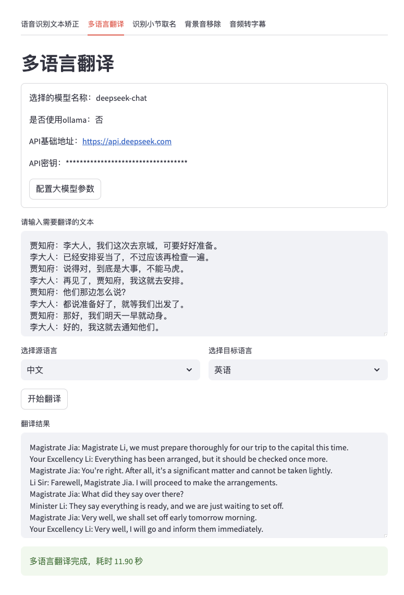

# LiberSonora

> todo:: 放一个 logo，纯色底，音频和书籍相关

LiberSonora，意为自由的声音，是一系列 AI 赋能的、强大的、开源的有声书工具集，全程离线，支持 GPU 加速、批量处理及自定义大模型


## 项目亮点
* MIT 真开源免费，音频处理、大模型推理全程本地离线运行，自主可控，数据安全有保障
* 项目容器化部署开发便利
* 支持 API，可以方便的集成到自己的工作流中去
* 各模块独立，可以单独启动某个模块的服务，比如音频增强、字幕识别等
* 支持根据实际需要，自定义大模型处理某项任务提升效果
* 配置灵活，满足多样性需求

## 界面

批量处理有声书页面


独立服务测试页面



# Roadmap
目前整体有三期规划：
* 第一期：有声书音频字幕提取、AI命名工具、AI多语言翻译、英语有声书支持，项目主页搭建
* 第二期：全平台有声书播放器，尽量用 webdav 这种公开协议 + 本地同步的方式，避免服务端开发
* 第三期：AI 制作工具，结合声音克隆、自动拆分排版，可与第二期联动

> 受限于个人精力以及工作、家庭的平衡，进展可能比较缓慢，也可能一期二期都做一些核心功能后再逐步完善
> - todo: 放一个赞助码

第一期的 AI 工具拟解决如下问题：
- 下载的有声书命名通常为 "第001集_xxxx.mp3"、"Chapter_001.mp3"，无法通过标题初步判断内容并找到自己最想听的部分
- 一般都没有字幕，无法在播放器中通过文字内容进行进度跳转
- 在听非母语资源时，有大模型翻译的多语言字幕方便学习

第二期的播放器拟解决如下痛点：
- 按照有声书的逻辑归类：商业软件的播放器的本地播放功能都比较弱，管理使用不便也不够美观，不时还有弹窗广告骚扰
- - 纯洁无广告
- - 抓取互联网图片做有声书封面
- - 进度管理按照有声书的维度来
- 支持 webdav、smb 等协议，方便挂 ALIST 或者 NAS 上的资源，做到资源维护和使用分离
- 支持离线模式和离线下载逻辑，节省机内空间，解决外出场景
- 超大声音模式：通勤、散步场景，环境音特别吵，不想戴耳机、更不想带随身音响，部分有声书声音特小，手机的音筒得贴到脸上才能听清，冬天冻手夏天汗
- - 牺牲音质实现超大音量

第三期的落地方向还不确定，因为现在喜马拉雅等公司已经有很方便的产品了


### 本期产品功能列表

[x] 有声音频批量处理
[x] 移除背景音
[x] 本地大模型进行字幕矫正
[x] 本地大模型生成双语字幕
[x] 本地大模型生成标题生成
[x] 自动标点移除
[x] 支持灵活的批量重命名
[x] API 支持
[ ] 提供云服务
[ ] CPU 可运行（低优先级，可能不做，由于 clear-voice 和 funasr 项目依赖原因，这个项目现在只能用带 nvidia GPU 的环境运行）

### 转换示例下载

> 有声书资源均来自互联网，若侵删

| 书名 | 下载链接 |
|------|----------|
| 《资本论》 | 链接待补充 |
| 《苦难辉煌》 | 链接待补充 |
| 《毛泽东选集》 | 链接待补充 |

## 音乐软件字幕兼容性
| 软件名称 | 本地音乐 | 本地字幕支持 | 多语言字幕兼容 | 备注 |
|----------|----------|--------------|----------------|------|
| 网易云音乐 | 支持 | 支持 | 兼容 | |
| 小米音乐 | 支持 | 支持 | 兼容 | 单语言字幕正常，但多语言字幕进度条会偏快 |
| QQ音乐 | 支持 | 不支持 | 不兼容 | 只能云搜索歌词 |
| 酷狗音乐 | 支持 | 不支持 | 不兼容 | 只能云搜索歌词 |
| 酷我音乐 | 支持 | 不支持 | 不兼容 | 只能云歌词 |
| 汽水音乐 | 不支持 | 不支持 | 不兼容 | |
| 咪咕音乐 | 支持 | 不支持 | 不兼容 | |
| 喜马拉雅 | 不支持 | 不支持 | 不支持 | 不能导入 |
| MacOS Apple Music | 支持 | 不支持 | 不支持 | 不能导入 lrc/src 音频 |


## 快速开始

> 注：项目依赖安装和模型下载已配置国内镜像，但 docker 的代理得自行设置，安装速度取决于网速和服务器性能，安装依赖大概15分钟，推理模型下载取决于网速，一般十分钟内

1. 克隆项目仓库：
   ```
   git clone https://github.com/LiberSonora/LiberSonora
   ```

2. 进入项目目录：
   ```
   cd LiberSonora
   ```

3. 启动 Docker 容器：
   ```
   docker-compose -f docker-compose.gpu.yml up -d
   ```

4. 查看容器运行日志：
   ```
   docker-compose -f docker-compose.gpu.yml logs -f
   ```

5. 访问用户界面：
   打开浏览器，访问 `xxx.xxx.xxx.xxx:8651`（将 xxx.xxx.xxx.xxx 替换为您的服务器 IP 地址）

6. API 端点：
   API 服务可通过 `xxx.xxx.xxx.xxx:8652` 访问（将 xxx.xxx.xxx.xxx 替换为您的服务器 IP 地址）

## API 接口文档

### 批量处理音频

> 注意：建议仅在内网环境中调用此接口，或者在外部调用时添加 OSS 上传下载的逻辑层。

**请求 URL:** `http://xxx.xxx.xxx.xxx:8652/handle`

**请求方法:** POST

**请求头：**
```
Content-Type: multipart/form-data
```

**请求参数：**

| 参数名 | 类型 | 说明 |
|--------|------|------|
| files  | File | 要处理的音频文件，支持多文件上传 |
| config | JSON | 处理配置，可从 UI 的"预览配置"处获取 |


**示例请求：**

```bash
curl --location --request POST 'http://xxx.xxx.xxx.xxx:8652/handle' \
--header 'User-Agent: Apifox/1.0.0 (https://apifox.com)' \
--form 'files=@"/path/to/your/audiofile.mp3"' \
--form 'config="{}"'
```

**响应：**

接口响应为一个 zip 压缩包，可以点击下载 [多语言字幕](./assets/test-multilang.zip) 和 [原始字幕](./assets/test-single.zip) 测试结果

- aaa.mp3
- aaa.srt
- aaaa.lcr
- bbb.mp3
- bbb.srt
- bbb.lcr


## 系统要求

| 组件 | 最低要求 | 备注 |
|------|----------|------|
| 显存 | 8GB 或更高 | 4GB NVIDIA GPU 也能运行但速度较慢 |
| 内存 | 16GB 或更高 | |
| 磁盘空间 | 50GB 以上 | |

### 性能测试

> 配置和环境：e3-1275v5 + 2080ti + 32GB DDR4，Ubuntu 22.04


5分钟有声书，共902字，所有功能拉满，总耗时 42.56s，但一般只需要生成字幕+标题生成，合在一起每小节 9s 执行完毕

| 处理项目 | 耗时 |
|----------|---------------------|
| 背景音移除 | 13.01s |
| 生成字幕 | 8.83s |
| 文本矫正 | 11.26s |
| 多语言翻译 | 11.03s |
| 标题生成 | 0.23s |

## 开源项目

| 项目名称 | 项目地址 | 用途 |
|----------|----------|------|
| ClearerVoice-Studio | https://github.com/modelscope/ClearerVoice-Studio | 移除背景音 |
| FFmpeg | https://github.com/FFmpeg/FFmpeg | 音频转码 |
| FunASR | https://github.com/modelscope/FunASR | 字幕提取 |
| Ollama | https://github.com/ollama/ollama | 大模型推理 |
| Qwen2.5 | https://github.com/QwenLM/Qwen2.5 | 大模型推理 |
| MiniCPM | https://github.com/OpenBMB/MiniCPM | 大模型推理 |
| Sanic | https://github.com/sanic-org/sanic | 对外暴露 API 接口 |
| Streamlit | https://github.com/streamlit/streamlit | 页面交互 |
| StreamlitAntdComponents | https://github.com/nicedouble/StreamlitAntdComponents | 页面交互，实现步骤条 |

## 开发说明

项目主要包含三个核心服务：

1. **services/streamlit**：
   负责提供用户界面和交互功能。

2. **clear-voice**：
   用于音频背景音移除处理。

3. **funasr**：
   处理语音识别和字幕生成。

### 开发流程

1. 克隆并进入项目目录：
   ```
   git clone https://github.com/LiberSonora/LiberSonora
   cd LiberSonora
   ```

2. 启动开发环境：
   ```
   docker-compose -f docker-compose.gpu.yml up -d
   ```

3. 修改代码：
   - UI 相关修改：更新 `services/streamlit` 目录下的代码，保存后 UI 会自动刷新。
   - API 相关修改：更新相应服务的代码后，需要重启对应的 Docker 容器：
     ```
     docker-compose -f docker-compose.gpu.yml restart {service}
     ```
     将 {service} 替换为需要重启的服务名（如 streamlit、clear-voice 或 funasr）。

通过以上步骤，您可以方便地进行开发和测试。记得及时提交您的更改并推送到代码仓库。


## 问题反馈

如果您在使用过程中遇到任何问题或有改进建议，欢迎通过以下方式反馈：

1. 在 GitHub 上提交 Issue：
   - 访问我们的 [GitHub Issues 页面](https://github.com/LiberSonora/LiberSonora/issues)
   - 点击 "New Issue" 按钮
   - 选择适当的 issue 模板（如果有）
   - 详细描述您遇到的问题或建议

我们会认真查看每一个 issue，并尽快回复。

## 开源许可

本项目采用 [MIT 许可证](https://opensource.org/licenses/MIT)。

您可以在项目根目录的 `LICENSE` 文件中查看完整的许可证文本。