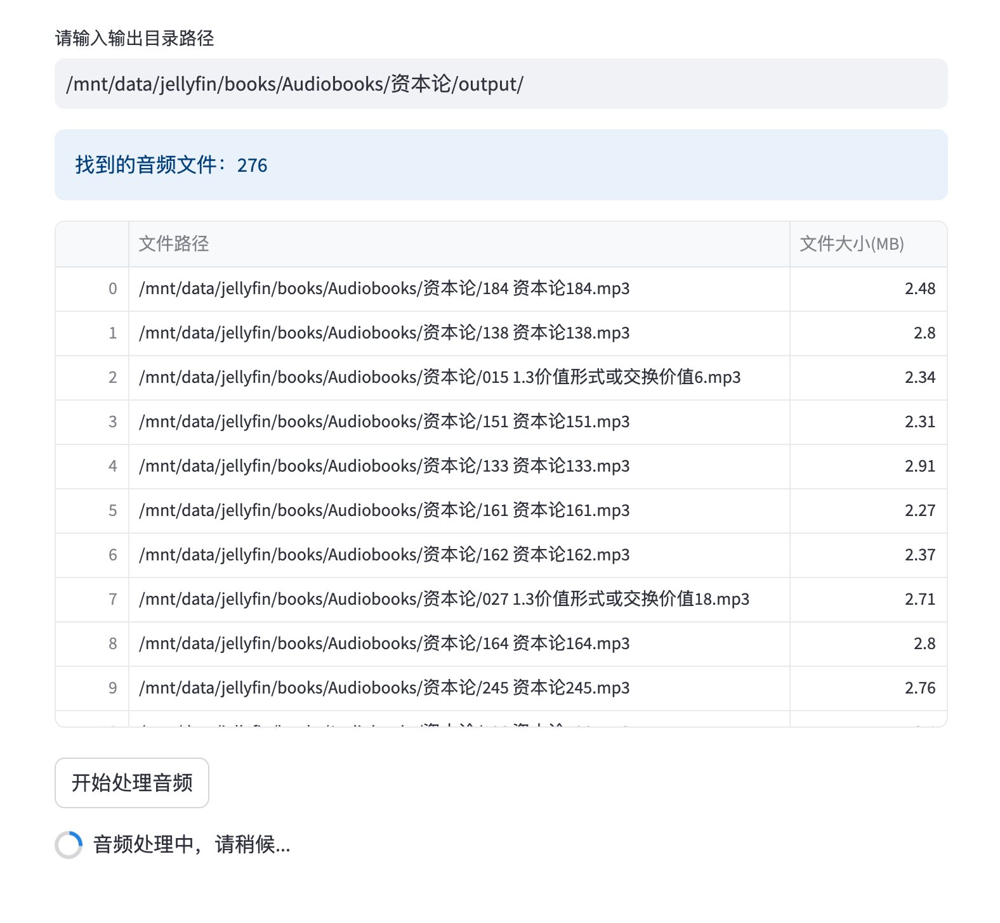
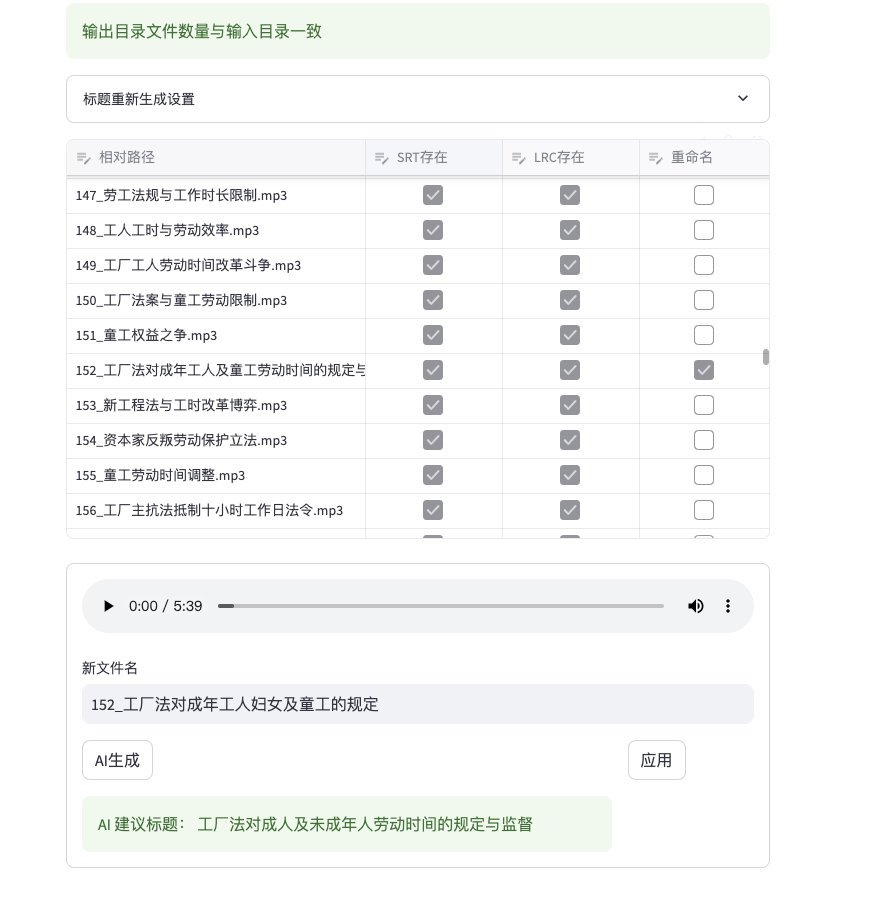
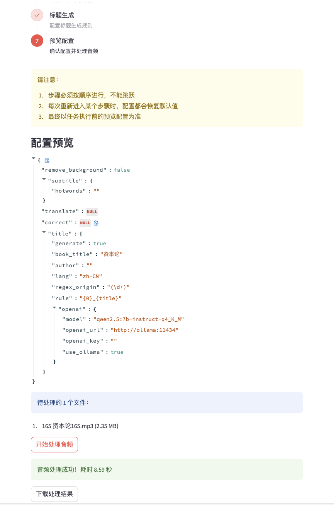
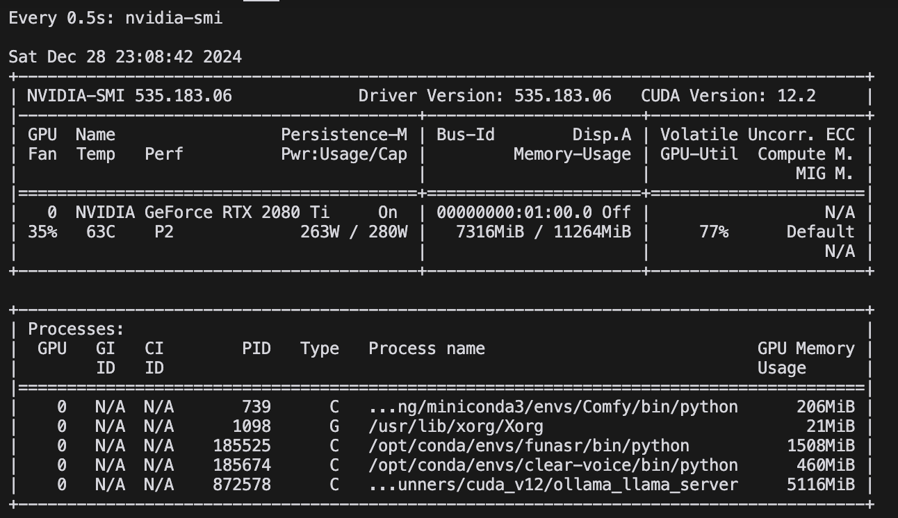

LiberSonora, meaning "Free Voice", is an AI-powered, powerful, open-source audiobook toolkit that operates entirely offline, supports GPU acceleration, batch processing, and custom large models

> Developed with Deepseek + Cursor ❤

[中文版](README.md) | English Version

Project website and latest documentation: [https://libersonora.github.io/](https://libersonora.github.io/) (Chinese only)

## 🌟 Project Highlights

📚 **Open Source Freedom**
- MIT licensed, truly open source and free
- Audio processing and large model inference run entirely locally offline
- Self-controlled, ensuring data security

🚀 **Easy Deployment**
- Containerized project for convenient development and deployment
- API support for easy integration into personal workflows

🧩 **Modular Design**
- Independent functional modules
- Can start specific services separately (e.g. audio enhancement, subtitle recognition)

🔧 **Flexible Customization**
- Supports custom large models to improve performance for specific tasks
- Flexible and diverse configurations to meet different needs

💡 **Innovative Features**
- Continuous updates with latest AI technologies
- Provides unique audio processing and text generation capabilities

# 🚀 LiberSonora Development Plan

The project's vision is to create a comprehensive audiobook ecosystem, implemented in three phases:

## 🎯 Phase 1: Intelligent Subtitle Extraction, Title Generation and Multilingual Support (Code in this repository, completed)
🎯 Core problems solved:
- 📁 Smart renaming: Get rid of meaningless names like "Episode 001_xxxx.mp3", "Chapter_001.mp3", easily find content of interest
- 📄 Automatic subtitle generation: Add accurate subtitles to audio without subtitles, enabling quick text content positioning
- 🗣️ Multilingual learning assistance: Provide multilingual subtitles through large model translation, aiding language learning

✨ Features:
- 🎙️ Audiobook audio subtitle extraction
- 🏷️ AI smart naming tool
- 🌐 AI-driven multilingual translation
- 🇬🇧 Full support for English audiobooks
- 🧠 Flexible large model configuration at subtask level
- 🏠 Project website setup

## 🎵 Phase 2: Cross-platform Audiobook Player (Feature and tech stack planning in progress, start time TBD)

If interested, please visit [🎧 Cross-platform Audiobook Player Requirements Discussion](https://github.com/LiberSonora/LiberSonora/discussions/2) to share your ideas

🎯 Core problems solved:
- 🎧 Weak local functionality in commercial players
- 🗂️ Inconvenient file management, unattractive interface
- 🚫 Frequent pop-up ads disrupting user experience

✨ Features:
- 💻🍎📱 Cross-platform support
- ☁️ Using open protocols like WebDAV for local sync, avoiding complex server development
- 🖥️ NAS-friendly server, supporting docker, Feiniu, Synology etc.
- 📚 Audiobook-specific logic:
   - 🚫 Pure ad-free experience
   - 🖼️ Automatic web cover fetching
   - 📊 Audiobook-level progress management, speed control, independent volume control
- 🔗 Support WebDAV, SMB protocols, easy integration with ALIST or NAS resources
- 📴 Offline mode and download function, saving storage space, adapting to various usage scenarios
- 🔊 Super volume mode:
   - Suitable for noisy environments (commuting, walking)
   - Release louder volume from phone without headphones or portable speakers
   - Solve the problem of low volume in some audiobooks
   - Sacrifice some sound quality for louder output

## 🔮 Phase 3: AI-assisted Creation Tools (No plan yet)

✨ Features:
- 🗣️ Integrate voice cloning technology
- 👶🏻 AI-generated content, telling stories in parents' voice, import to Huohuotu
- 📑 Intelligent content generation, splitting and formatting
- 🔗 Deep integration with Phase 2 player

> ⏳ Project progress may be slow due to personal time and energy constraints. Plan to implement core features of Phase 1 and 2 first, then gradually improve details.

💖 If you like this project, welcome to sponsor our development!


## Feature List

- [x] Batch audiobook processing
- [x] Background noise removal
- [x] Subtitle correction using local large model
- [x] Bilingual subtitle generation using local large model
- [x] Title generation using local large model
- [x] Automatic punctuation removal
- [x] Flexible batch renaming support
- [x] API support
- [x] Support for audio conversion over 3 hours
- [ ] Provide cloud service
- [ ] Internationalization, implement English interface and English README
- [ ] CPU operation (low priority, may not implement due to clear-voice and funasr project dependencies, currently requires nvidia GPU environment)

### Subtitle Conversion and Renaming Example Downloads

> Audiobook resources are from the internet, for reference and learning only. Please contact me for removal if any copyright infringement

> If you want to convert audiobooks you're listening to but don't want to set up environment, please visit [📚Audiobook Conversion Experience Zone](https://github.com/LiberSonora/LiberSonora/discussions/1) to leave comments

| Title | Download Link | Code | Note |
|------|----------|--------|------|
| 《Capital.Marx》 | https://pan.quark.cn/s/7d2e048b0747 | uhjP | Classic political economics, Chinese |
| 《苦难辉煌.Jin Yinan》 | https://pan.quark.cn/s/b37fd2be9d50 | Mhud | Modern history, Chinese |
| 《Selected Works of Mao Zedong》 | https://pan.quark.cn/s/db5d332ca110 | 1Vvr | Chinese |
| 《Alice's Adventures in Wonderland.Lewis Carroll》 | https://pan.quark.cn/s/2699b5b63abc | FNx8 | Alice in Wonderland, source English + English title + auto-translated Chinese subtitles |
| 《Romeo and Juliet.William Shakespeare》 | https://pan.quark.cn/s/27cb7de6f7ce | pjJ9 | Romeo and Juliet, source English + English title + auto-translated Chinese subtitles |

## Subtitle Recognition and Large Model Translation Support

### Subtitle Recognition Support
- ✅ Chinese (zh-CN)
- ✅ English (en)

### Multilingual Subtitle Translation Support

| Language | Support Status | Note |
|------|----------|------|
| Chinese (zh-CN) | ✅ Supported | Source language, translation target |
| English (en) | ✅ Supported | Source language, translation target |
| Japanese (ja) | ✅ Supported | Translation target |
| French (fr) | ✅ Supported | Translation target |
| German (de) | ✅ Supported | Translation target |

> Note: Multilingual subtitle translation depends on local large model, translation quality may vary based on model version and context understanding ability

## Music Software Subtitle Compatibility
| Software | Local Music | Local Subtitle Support | Multilingual Subtitle Compatibility | Note |
|----------|----------|--------------|----------------|------|
| NetEase Cloud Music | Supported | Supported | Compatible | |
| Xiaomi Music | Supported | Supported | Compatible | Single language subtitles normal, but multilingual subtitle progress bar may be faster |
| QQ Music | Supported | Not Supported | Incompatible | Can only search lyrics online |
| KuGou Music | Supported | Not Supported | Incompatible | Can only search lyrics online |
| Kuwo Music | Supported | Not Supported | Incompatible | Only online lyrics |
| Qishui Music | Not Supported | Not Supported | Incompatible | |
| Migu Music | Supported | Not Supported | Incompatible | |
| Himalaya | Not Supported | Not Supported | Not Supported | Cannot import |
| Lazy Audio | Not Supported | Not Supported | Not Supported | Cannot import |
| Tomato Listening | Supported | Not Supported | Not Supported | Tried importing twice, cannot select folder partially, crashed |
| Qingting FM | Not Supported | Not Supported | Not Supported | Cannot import |
| MacOS Apple Music | Supported | Not Supported | Not Supported | Cannot import lrc/src audio |

> Compared to current commercial players, NetEase Cloud has better compatibility for local audiobook playback, but its local music lacks progress recording or played status, making it hard to find progress after switching to online music, which is one reason for wanting to create a cross-platform open-source audiobook player


## 🖥️ Feature Interface Showcase

#### Supported Large Model Providers
- **Ollama**: Lightweight large model service running locally, supports multiple open-source models, suitable for local deployment
- **DeepSeek**: API service provided by DeepSeek, strong Chinese processing capability, excellent performance
- **OpenAI**: World-leading AI service provider, powerful models but requires internet connection

#### Supported Model List
| Provider | Model Name | Description |
|--------|----------|------|
| Ollama | Qwen2.5-7B-Instruct-Q4_K_M | Powerful multilingual model, supports multiple tasks, excellent performance |
| Ollama | Qwen2.5-14B-Instruct-Q4_K_M | More powerful multilingual model, better performance but slower |
| Ollama | minicpm3-4B-Q4_K_M | Lightweight model running locally, fast |
| DeepSeek | DeepSeek Chat | DeepSeek's dialogue model, suitable for Chinese scenarios |
| DeepSeek | DeepSeek R1 | DeepSeek's COT reasoning model, better quality but slower |
| OpenAI | GPT-4O | OpenAI's strongest model, best performance but higher cost |
| OpenAI | GPT-3.5 Turbo | OpenAI's fast model, cost-effective |

> Tip: Can flexibly choose different models based on task requirements, local models don't require internet connection, cloud models have better performance but require API keys


| **🤖 Multi-model Selection** | **📚 Batch Audiobook Processing** | **🖥️ Server Local Audio Processing** | **🔍 Manual Output Check** | **🧪 Independent Service Test** |
|-------------------|-----------------------|---------------------------|-------------------------|---------------------|
| Flexible model selection, supports multiple large models including local Ollama, DeepSeek and OpenAI | Powerful batch processing function, easily handles large quantities of audiobooks | Offline processing of server local audio files, eliminates file transfer steps, improves processing efficiency | Convenient manual check function, allows manual naming or AI regeneration | Flexible single service testing, quickly verifies various functions |
|  |  |  |  |  |

## Quick Start

> Note: Project dependency installation and model download have configured domestic mirrors, but docker proxy needs to be set up yourself, installation speed depends on network speed and server performance, dependency installation takes about 15 minutes, inference model download depends on network speed, usually within 10 minutes

1. Clone project repository:
   ```
   git clone https://github.com/LiberSonora/LiberSonora
   ```

2. Enter project directory:
   ```
   cd LiberSonora
   ```

3. Start Docker container:
   ```
   docker-compose -f docker-compose.gpu.yml up -d
   ```

4. View container logs:
   ```
   docker-compose -f docker-compose.gpu.yml logs -f
   ```

5. Access user interface:
   Open browser, visit `xxx.xxx.xxx.xxx:8651` (replace xxx.xxx.xxx.xxx with your server IP)

6. API endpoint:
   API service accessible via `xxx.xxx.xxx.xxx:8652` (replace xxx.xxx.xxx.xxx with your server IP)

## API Documentation

### Batch Audio Processing

> Note: It is recommended to call this interface only in intranet environments, or add OSS upload/download logic layer when calling externally.

**Request URL:** `http://xxx.xxx.xxx.xxx:8652/handle`

**Request Method:** POST

**Request Headers:**
```
Content-Type: multipart/form-data
```

**Request Parameters:**

| Parameter | Type | Description |
|-----------|------|-------------|
| files     | File | Audio files to process, supports multiple file uploads |
| config    | JSON | Processing configuration, can be obtained from UI's "Preview Config" |



**Example Request:**

```bash
curl --location --request POST 'http://xxx.xxx.xxx.xxx:8652/handle' \
--header 'User-Agent: Apifox/1.0.0 (https://apifox.com)' \
--form 'files=@"/path/to/your/audiofile.mp3"' \
--form 'config="{}"'
```

**Response:**

The interface response is a zip file, you can click to download [multilingual subtitle](./assets/test-multilang.zip) and [original subtitle](./assets/test-single.zip) test results

- aaa.mp3
- aaa.srt
- aaaa.lcr
- bbb.mp3
- bbb.srt
- bbb.lcr


## System Requirements

| Component | Minimum Requirements | Notes |
|-----------|----------------------|-------|
| GPU Memory | 8GB or higher | 4GB NVIDIA GPU can run but slower |
| RAM       | 16GB or higher | |
| Disk Space | 50GB or more | |

### Performance Test

> Configuration and Environment: e3-1275v5 + 2080ti + 32GB DDR4, Ubuntu 22.04




5-minute audiobook, 902 words, all features enabled, total time 42.56s, but usually only needs subtitle generation + title generation, takes only 9s to complete

| Processing Item | Time Consumed |
|-----------------|---------------|
| Background Noise Removal | 13.01s |
| Subtitle Generation | 8.83s |
| Text Correction | 11.26s |
| Multilingual Translation | 11.03s |
| Title Generation | 0.23s |

> Using the "Process Server Local Audio" page feature is more suitable for batch file processing, just put files in `/mnt/data/xxx/` directory and provide configuration, processing directly on server can save a lot of file upload/download and packaging resource consumption, and can also achieve offline processing indirectly, just wait for generation to complete

## Open Source Projects

| Project Name | Project URL | Usage |
|--------------|-------------|-------|
| ClearerVoice-Studio | https://github.com/modelscope/ClearerVoice-Studio | Background noise removal |
| FFmpeg | https://github.com/FFmpeg/FFmpeg | Audio transcoding |
| FunASR | https://github.com/modelscope/FunASR | Subtitle extraction |
| Ollama | https://github.com/ollama/ollama | Large model inference |
| Qwen2.5 | https://github.com/QwenLM/Qwen2.5 | Large model inference |
| MiniCPM | https://github.com/OpenBMB/MiniCPM | Large model inference |
| Sanic | https://github.com/sanic-org/sanic | Expose API interface |
| Streamlit | https://github.com/streamlit/streamlit | Page interaction |
| StreamlitAntdComponents | https://github.com/nicedouble/StreamlitAntdComponents | Page interaction, implement step bar |

## Development Instructions

The project mainly contains three core services:

1. **services/streamlit**:
    Responsible for providing user interface and interaction functions.

2. **clear-voice**:
    Used for audio background noise removal processing.

3. **funasr**:
    Handles speech recognition and subtitle generation.

### Development Process

1. Clone and enter project directory:
    ```
    git clone https://github.com/LiberSonora/LiberSonora
    cd LiberSonora
    ```

2. Start development environment:
    ```
    docker-compose -f docker-compose.gpu.yml up -d
    ```

3. Modify code:
    - UI related modifications: Update code in `services/streamlit` directory, UI will refresh automatically after saving.
    - API related modifications: After updating corresponding service code, need to restart corresponding Docker container:
    ```
    docker-compose -f docker-compose.gpu.yml restart {service}
    ```
    Replace {service} with the service name that needs to be restarted (such as streamlit, clear-voice or funasr).

Through the above steps, you can conveniently develop and test. Remember to commit your changes and push to code repository in time.

## Issue Reporting

If you encounter any problems or have suggestions for improvement while using the project, please feel free to provide feedback through the following methods:

1. Submit an Issue on GitHub:
   - Visit our [GitHub Issues page](https://github.com/LiberSonora/LiberSonora/issues)
   - Click the "New Issue" button
   - Select the appropriate issue template (if available)
   - Provide a detailed description of the problem or suggestion

We will carefully review every issue and respond as soon as possible.

## Open Source License

This project is licensed under the [MIT License](https://opensource.org/licenses/MIT).

You can view the complete license text in the `LICENSE` file in the project root directory.
